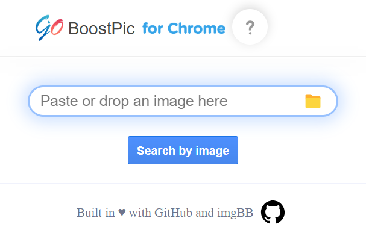

# BoostPic

    
  
  
  
    

Uncover the possibility to search Google Images quickly and incredibly, with clip & paste.

# How it works

1. For win10/11: win+shift+s to clip an image even outside the browser, and for mac: shift+control+command+4

   

2. Enter Google Images, click at the search by image icon (or the input box at the extension popup), and then press ctrl+v or command+v.

   

3. Wait a moment until it returns an URL. If timeout error happens, please delete the error message and ctrl+v or command+v again.

   

# Architecture

# Development Note

Difference between BoostPic_Chrome and BoostPic_FireFox:

> BoostPic_Chrome is Manifest V3 and BoostPic_FireFox is Manifest V2. The corresponding background.ts files are a little different.

# LICENSE

Copyleft © [BoostPic](https://github.com/boostpic/boostpic)

[Apache II](./LICENSE)

# Enjoy! &#9829;&#9829;&#9829;
